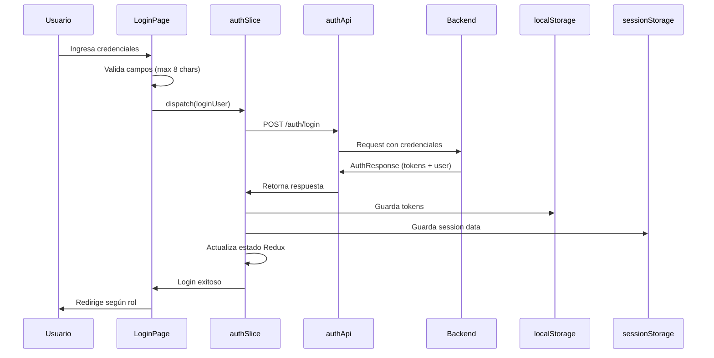

# 🔐 AUTH - Módulo de Autenticación y Autorización

**Módulo ID**: AUTH  
**Versión**: 1.0  
**Última actualización**: 2026-01-26  
**Propósito**: Gestión completa de autenticación de usuarios, autorización basada en roles, y seguridad de sesiones

---

## 📋 Descripción General

El módulo AUTH es el núcleo de seguridad del sistema CardDemo. Proporciona funcionalidades completas para autenticar usuarios, gestionar sesiones de manera segura, controlar el acceso basado en roles, y proteger rutas de la aplicación.

### Responsabilidades Principales

- ✅ Autenticación de usuarios mediante credenciales
- ✅ Gestión segura de tokens JWT (access y refresh tokens)
- ✅ Autorización basada en roles (admin, back-office)
- ✅ Protección de rutas según permisos
- ✅ Gestión de sesión con expiración automática
- ✅ Validación y renovación de tokens
- ✅ Logout seguro con limpieza de datos

---

## 🏗️ Arquitectura del Módulo

### Componentes Clave

#### 1. **authSlice.ts** - Redux State Management
Ubicación: `/app/features/auth/authSlice.ts`

**Responsabilidad**: Gestión del estado de autenticación en Redux

**Estado gestionado**:
```typescript
interface AuthState {
  user: User | null;              // Usuario autenticado
  token: string | null;           // Access token JWT
  isAuthenticated: boolean;       // Estado de autenticación
  isLoading: boolean;            // Carga en proceso
  error: string | null;          // Errores de autenticación
}
```

**Acciones Asíncronas**:
- `loginUser`: Autenticar usuario con credenciales
- `logoutUser`: Cerrar sesión del usuario
- `refreshToken`: Renovar access token usando refresh token
- `validateToken`: Validar token JWT actual

**Acciones Síncronas**:
- `clearError`: Limpiar errores
- `setCredentials`: Establecer credenciales manualmente
- `clearCredentials`: Limpiar credenciales
- `immediateLogout`: Logout inmediato con limpieza total

#### 2. **authApi.ts** - API Service
Ubicación: `/app/services/authApi.ts`

**Responsabilidad**: Comunicación con endpoints de autenticación del backend

**Endpoints disponibles**:
```typescript
POST /auth/login          // Login de usuario
POST /auth/logout         // Logout de usuario
POST /auth/refresh        // Refrescar access token
POST /auth/validate       // Validar token JWT
GET  /auth/health         // Health check del servicio
```

**Interfaces principales**:
```typescript
interface AuthResponse {
  accessToken: string;
  refreshToken: string;
  tokenType: string;
  userId: string;
  fullName: string;
  userType: string;        // 'A' = Admin, 'U' = Back-office
  expiresIn: number;
  message: string;
}

interface TokenValidationResponse {
  valid: boolean;
  userId?: string;
  message: string;
}
```

#### 3. **ProtectedRoute.tsx** - Componente de Protección
Ubicación: `/app/components/auth/ProtectedRoute.tsx`

**Responsabilidad**: Proteger rutas según autenticación y roles

**Funcionalidades**:
- Verificación de autenticación
- Validación de token al cargar ruta
- Control de acceso basado en roles
- Verificación de expiración de sesión
- Redirección automática según rol o a login

**Uso**:
```tsx
<ProtectedRoute requiredRole="admin">
  <AdminPage />
</ProtectedRoute>
```

#### 4. **useSecureSession** - Hook Personalizado
Ubicación: `/app/hooks/useSecureSession.ts`

**Responsabilidad**: Gestión segura de sesión con validaciones automáticas

**Funcionalidades**:
- Verificación de expiración de sesión (8 horas)
- Renovación automática de tokens (cada 5 minutos)
- Limpieza de sesión al cerrar ventana
- Validación al cambiar visibilidad de pestaña
- Logout inmediato cuando sesión expira

**Métodos expuestos**:
```typescript
{
  checkSessionExpiry: () => boolean;
  attemptTokenRefresh: () => Promise<boolean>;
  clearSession: () => void;
  performImmediateLogout: () => void;
}
```

#### 5. **LoginPage.tsx** - Página de Login
Ubicación: `/app/pages/LoginPage.tsx`

**Responsabilidad**: Interfaz de usuario para autenticación

**Características**:
- Formulario de login con validación
- Conversión automática a mayúsculas
- Límite de 8 caracteres por campo
- Visualización de contraseña
- Manejo de errores amigable
- Redirección según rol después de login
- Credenciales de prueba mostradas
- Botón de acceso a documentación

---

## 🔗 APIs Documentadas

### POST /auth/login
**Descripción**: Autenticar usuario y obtener tokens

**Request**:
```json
{
  "userId": "ADMIN001",
  "password": "PASSWORD"
}
```

**Response exitosa (200)**:
```json
{
  "accessToken": "eyJhbGciOiJIUzI1NiIsInR5cCI6IkpXVCJ9...",
  "refreshToken": "mock-refresh-token-ADMIN001",
  "tokenType": "Bearer",
  "userId": "ADMIN001",
  "fullName": "Administrator User",
  "userType": "A",
  "expiresIn": 3600,
  "message": "Login successful"
}
```

**Response error (401)**:
```json
{
  "error": "Invalid credentials",
  "message": "User ID or password incorrect"
}
```

### POST /auth/logout
**Descripción**: Cerrar sesión del usuario

**Request**: No requiere body (usa token en header)

**Response exitosa (200)**:
```json
{
  "message": "Logout successful"
}
```

### POST /auth/refresh
**Descripción**: Renovar access token

**Request**:
```json
{
  "refreshToken": "mock-refresh-token-ADMIN001"
}
```

**Response exitosa (200)**:
```json
{
  "accessToken": "eyJhbGciOiJIUzI1NiIsInR5cCI6IkpXVCJ9..."
}
```

### POST /auth/validate
**Descripción**: Validar token JWT

**Request**:
```json
{
  "token": "eyJhbGciOiJIUzI1NiIsInR5cCI6IkpXVCJ9..."
}
```

**Response exitosa (200)**:
```json
{
  "valid": true,
  "userId": "ADMIN001",
  "message": "Token is valid"
}
```

---

## 📊 Modelos de Datos

### User
```typescript
interface User {
  id: number;                    // ID numérico interno
  userId: string;                // ID de usuario (ej: "ADMIN001")
  name: string;                  // Nombre completo
  role: 'admin' | 'back-office'; // Rol del usuario
  avatar: string;                // URL del avatar
  createdAt: string;             // Fecha de creación (ISO)
  isActive: boolean;             // Estado activo/inactivo
}
```

### LoginCredentials
```typescript
interface LoginCredentials {
  userId: string;     // Máximo 8 caracteres, convertido a mayúsculas
  password: string;   // Máximo 8 caracteres, convertido a mayúsculas
}
```

### SessionData (sessionStorage)
```typescript
interface SessionData {
  userId: string;     // ID del usuario autenticado
  userType: string;   // 'A' o 'U'
  role: string;       // 'admin' o 'back-office'
  loginTime: number;  // Timestamp de login
}
```

---

## 🔐 Reglas de Negocio

### Autenticación

1. **Validación de Credenciales**:
   - User ID: máximo 8 caracteres, obligatorio
   - Password: máximo 8 caracteres, obligatorio
   - Ambos campos se convierten automáticamente a mayúsculas
   - Sin espacios en blanco permitidos

2. **Roles de Usuario**:
   - `admin` (userType: 'A'): Acceso completo al sistema
   - `back-office` (userType: 'U'): Acceso limitado a funciones operativas

3. **Tokens**:
   - Access Token: válido por 1 hora (3600 segundos)
   - Refresh Token: válido por la duración de la sesión
   - Almacenados en localStorage para persistencia

### Sesión

1. **Duración de Sesión**:
   - Máximo 8 horas de sesión continua
   - Verificación cada 5 minutos
   - Renovación automática de token si está próximo a expirar

2. **Expiración**:
   - Logout automático después de 8 horas
   - Verificación al cambiar visibilidad de pestaña
   - Limpieza de sessionStorage al cerrar ventana

3. **Seguridad**:
   - Tokens almacenados solo en localStorage (no en cookies)
   - SessionStorage para datos temporales de sesión
   - Limpieza completa al hacer logout
   - Validación de token en cada ruta protegida

### Autorización

1. **Control de Acceso**:
   - Rutas protegidas requieren autenticación
   - Algunas rutas requieren rol específico
   - Redirección automática según rol:
     - Admin → `/menu/admin`
     - Back-office → `/menu/main`

2. **Protección de Rutas**:
   - Verificación de autenticación al cargar
   - Validación de rol si es requerido
   - Redirección a login si no autenticado
   - Redirección a menú correcto si rol no coincide

---

## 🎯 User Stories - Ejemplos

### Historia 1: Login de Usuario
```
Como usuario del sistema
Quiero poder iniciar sesión con mis credenciales
Para acceder a las funcionalidades según mi rol
```

**Criterios de Aceptación**:
- ✅ El formulario muestra campos para User ID y Password
- ✅ Los campos aceptan máximo 8 caracteres
- ✅ La entrada se convierte automáticamente a mayúsculas
- ✅ Se valida que ambos campos estén completos antes de enviar
- ✅ Se muestra un mensaje de error si las credenciales son inválidas
- ✅ Después de login exitoso, se redirige según el rol del usuario
- ✅ Se almacenan tokens de manera segura en localStorage

**Complejidad**: Simple (1-2 pts) - Uso de componentes y flujos existentes

---

### Historia 2: Protección de Rutas
```
Como administrador del sistema
Quiero que las rutas estén protegidas según roles
Para asegurar que los usuarios solo accedan a funciones permitidas
```

**Criterios de Aceptación**:
- ✅ Las rutas requieren autenticación para acceder
- ✅ Se verifica el rol del usuario para rutas con restricción
- ✅ Los usuarios no autenticados son redirigidos a login
- ✅ Los usuarios con rol incorrecto son redirigidos a su menú
- ✅ Se mantiene la URL destino para redirección después de login

**Complejidad**: Medio (3 pts) - Requiere lógica de autorización

---

### Historia 3: Gestión de Sesión Segura
```
Como usuario autenticado
Quiero que mi sesión expire automáticamente después de inactividad
Para proteger mi cuenta contra acceso no autorizado
```

**Criterios de Aceptación**:
- ✅ La sesión tiene duración máxima de 8 horas
- ✅ Se verifica la expiración cada 5 minutos
- ✅ El token se renueva automáticamente si está próximo a expirar
- ✅ Al expirar la sesión, se hace logout automático
- ✅ Se limpia toda la información al cerrar la ventana/pestaña
- ✅ Se verifica sesión al cambiar visibilidad de pestaña

**Complejidad**: Medio (3-5 pts) - Lógica de temporización y validación

---

### Historia 4: Renovación de Token
```
Como sistema
Quiero renovar automáticamente los tokens de acceso
Para mantener la sesión del usuario activa sin interrupciones
```

**Criterios de Aceptación**:
- ✅ El token se renueva cada 5 minutos mientras la sesión esté activa
- ✅ Se usa el refresh token para obtener nuevo access token
- ✅ Si falla la renovación, se hace logout automático
- ✅ La renovación no interfiere con la experiencia del usuario
- ✅ El nuevo token reemplaza al anterior en localStorage

**Complejidad**: Medio (3-5 pts) - Lógica asíncrona y manejo de errores

---

## ⚡ Factores de Aceleración de Desarrollo

### Componentes Reutilizables

1. **ProtectedRoute**: Componente listo para proteger cualquier ruta
2. **useSecureSession**: Hook con toda la lógica de sesión
3. **authSlice**: Redux slice completo con todas las acciones
4. **authApi**: Servicio con todos los endpoints configurados

### Patrones Establecidos

1. **Redux Toolkit Pattern**: Estructura clara para agregar nuevas acciones
2. **API Client Pattern**: Fácil agregar nuevos endpoints de auth
3. **Hook Pattern**: Patrón para crear hooks personalizados similares
4. **Protected Route Pattern**: Patrón replicable para otros tipos de protección

### Guías de Complejidad

- **Simple (1-2 pts)**: Agregar nueva validación de campo, cambiar mensaje de error
- **Medio (3-5 pts)**: Agregar nuevo método de autenticación, modificar flujo de tokens
- **Complejo (5-8 pts)**: Implementar autenticación multi-factor, integración con SSO

---

## 📋 Dependencias

### Dependencias Internas
- **Store (Redux)**: Para gestión de estado global
- **Router**: Para navegación y protección de rutas
- **API Client**: Para comunicación con backend
- **Types**: Interfaces compartidas (User, LoginCredentials, etc.)

### Dependencias Externas
- **@reduxjs/toolkit**: State management
- **react-router-dom**: Routing y navegación
- **@mui/material**: Componentes UI para LoginPage

### Módulos que Dependen de AUTH
- **Account**: Requiere autenticación para operaciones
- **Credit Card**: Requiere autenticación y rol
- **Transaction**: Requiere autenticación
- **User**: Requiere rol admin
- **Menu**: Muestra opciones según rol autenticado
- **Bill Payment**: Requiere autenticación

---

## 🧪 Testing y Mocking

### Mock Handlers (MSW)
Ubicación: `/app/mocks/authHandlers.ts`

**Usuarios de prueba**:
```typescript
// Admin
{ userId: "ADMIN001", password: "PASSWORD", role: "admin" }

// Back-office
{ userId: "USER001", password: "PASSWORD", role: "back-office" }
```

**Comportamiento de mocks**:
- Login exitoso retorna tokens válidos
- Logout siempre exitoso
- Refresh token genera nuevo access token
- Validate verifica estructura básica del token

---

## 🚨 Consideraciones de Seguridad

### Mejores Prácticas Implementadas

1. **Almacenamiento Seguro**:
   - Tokens en localStorage (no en sessionStorage para persistencia)
   - Datos de sesión temporales en sessionStorage
   - Limpieza completa al hacer logout

2. **Validación**:
   - Verificación de token en cada ruta protegida
   - Validación de expiración de sesión
   - Renovación automática de tokens

3. **Protección contra Ataques**:
   - Logout inmediato si token inválido
   - Limpieza de datos al cerrar ventana
   - Verificación al cambiar visibilidad

### Mejoras Futuras (Tech Debt)

1. **HttpOnly Cookies**: Migrar tokens a cookies HttpOnly para mayor seguridad
2. **CSRF Protection**: Implementar tokens CSRF
3. **Rate Limiting**: Limitar intentos de login
4. **2FA**: Autenticación de dos factores
5. **Biometric Auth**: Autenticación biométrica para móviles

---

## 📈 Métricas de Éxito

### Funcionales
- ✅ 100% de rutas protegidas correctamente
- ✅ 0 accesos no autorizados detectados
- ✅ Logout automático funciona en todos los casos

### Técnicas
- ⚡ Login completado en < 500ms
- ⚡ Validación de token en < 100ms
- ⚡ Renovación de token en < 300ms

### Negocio
- 📊 Tasa de login exitoso: > 98%
- 📊 Tiempo promedio de login: < 5 segundos
- 📊 Sesiones activas promedio: medible por analytics

---

## 🔄 Flujo de Autenticación Completo



---

**Última actualización**: 2026-01-26  
**Mantenido por**: Equipo DS3A  
**Precisión del código**: 95%+
