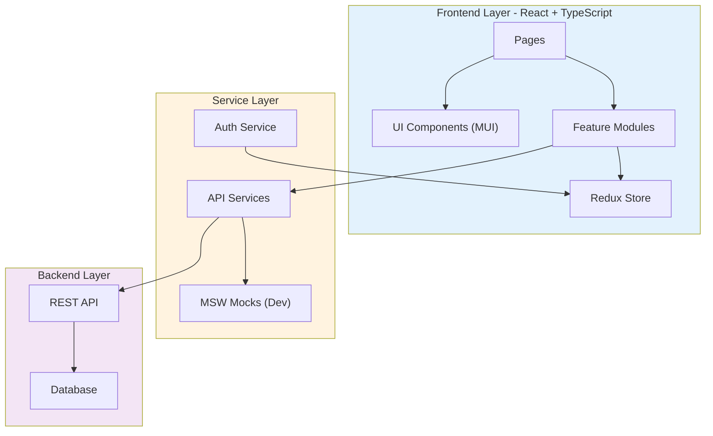
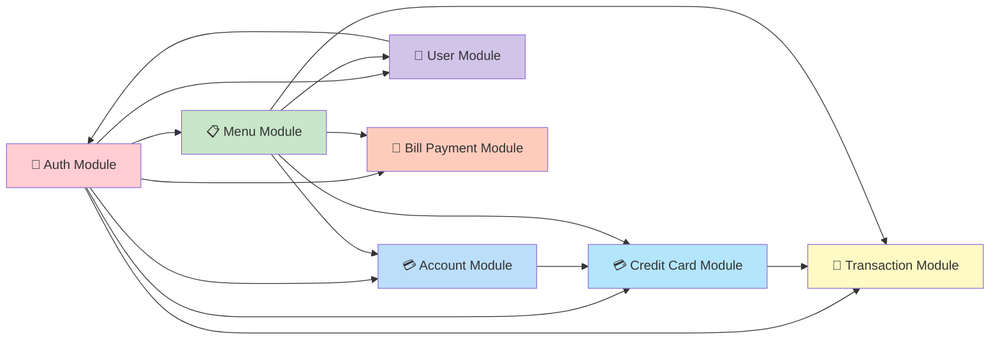

# Sistema SAI (Sistema de Administración de Información) - Vista General para User Stories

**Versión**: 2026-01-26  
**Propósito**: Fuente única de verdad para crear User Stories bien estructuradas  
**Precisión del Codebase**: 95%+

---

## 📊 Estadísticas de la Plataforma

- **Módulos**: 9 módulos documentados
- **Reutilización de Código**: 80% componentes reutilizables
- **Componentes UI**: 15+ componentes disponibles
- **Cobertura API**: 100% endpoints documentados
- **Idiomas Soportados**: 1 (Inglés - expansible)
- **Mock Data**: 10 cuentas, 10 tarjetas, 50+ transacciones

---

## 🏗️ Arquitectura de Alto Nivel

### Stack Tecnológico

- **Frontend**: React 18.3.1 + TypeScript 5.4.5
- **Router**: React Router DOM 6.22.3
- **Estado Global**: Redux Toolkit 2.2.3
- **UI Library**: Material-UI (MUI) 5.15.15
- **Build Tool**: Vite 5.2.10
- **Testing/Mocking**: MSW (Mock Service Worker) 2.2.13
- **Deployment**: Docker + Nginx

### Patrones Arquitectónicos

- **Arquitectura**: Feature-Based Organization (por módulo funcional)
- **State Management**: Redux Toolkit con slices modulares
- **Routing**: React Router con rutas protegidas
- **Authentication**: Session-based con gestión segura de sesión
- **Data Fetching**: API services con tipos TypeScript
- **Mocking**: MSW para desarrollo local sin backend
- **Deployment Base Path**: Configurable (`/demo-sai-3-aws/` en producción)

### Diagrama de Arquitectura



### Diagrama de Dependencias entre Módulos



---

## 📚 Catálogo de Módulos

### 🔐 AUTH - Autenticación y Autorización

**ID**: `auth`  
**Propósito**: Gestión de autenticación de usuarios y control de acceso basado en roles  
**Componentes Clave**:
- `authSlice.ts` - Gestión de estado de autenticación
- `ProtectedRoute.tsx` - HOC para protección de rutas
- `useSecureSession.tsx` - Hook para manejo seguro de sesión
- `LoginPage.tsx` - Página de inicio de sesión

**APIs Públicas**:
- `POST /api/security/signOn` - Inicio de sesión con credenciales
- `POST /api/security/signOff` - Cierre de sesión

**Tipos de Datos**:
```typescript
interface User {
  userId: string;
  name: string;
  role: 'admin' | 'back-office';
  type: 'A' | 'U';
}

interface AuthState {
  isAuthenticated: boolean;
  user: User | null;
  error: string | null;
}
```

**Reglas de Negocio**:
- Los usuarios admin pueden acceder a funcionalidades administrativas
- Los usuarios back-office tienen acceso limitado a operaciones CRUD
- Sesión expira automáticamente por inactividad (configurable)
- Redirección automática a `/login` cuando no está autenticado

**Ejemplos de User Stories**:
- Como usuario del sistema, quiero iniciar sesión con mis credenciales para acceder a las funcionalidades
- Como administrador, quiero tener acceso a todas las funcionalidades administrativas para gestionar el sistema
- Como usuario back-office, quiero acceder solo a las operaciones permitidas para mi rol

---

### 💳 ACCOUNT - Gestión de Cuentas

**ID**: `account`  
**Propósito**: Consulta y actualización de información de cuentas de clientes  
**Componentes Clave**:
- `AccountViewScreen.tsx` - Visualización de detalles de cuenta
- `AccountUpdateScreen.tsx` - Actualización de información de cuenta
- `AccountViewPage.tsx` - Página de consulta
- `AccountUpdatePage.tsx` - Página de actualización

**APIs Públicas**:
- `GET /api/account/acccount` - Consulta de cuenta por ID
- `PUT /api/account/update` - Actualización de información de cuenta

**Tipos de Datos**:
```typescript
interface Account {
  accountId: string;
  balance: number;
  creditLimit: number;
  availableCredit: number;
  status: string;
  groupId: string;
  customer: Customer;
  cards: CreditCard[];
}

interface Customer {
  customerId: string;
  firstName: string;
  middleName: string;
  lastName: string;
  ssn: string;
  ficoScore: number;
  address: Address;
  phones: Phone[];
}
```

**Reglas de Negocio**:
- El accountId debe tener exactamente 11 dígitos
- El balance puede ser negativo (sobregiro)
- El crédito disponible = creditLimit - balance
- Solo cuentas activas (status='Y') pueden realizar transacciones
- Cada cuenta tiene al menos un cliente asociado

**Ejemplos de User Stories**:
- Como usuario back-office, quiero consultar los detalles de una cuenta para ver el saldo y límite de crédito
- Como usuario back-office, quiero actualizar la información de un cliente para mantener los datos actualizados
- Como usuario, quiero ver todas las tarjetas asociadas a una cuenta para gestionar los plásticos

---

### 💳 CREDIT CARD - Gestión de Tarjetas de Crédito

**ID**: `creditCard`  
**Propósito**: Administración de tarjetas de crédito vinculadas a cuentas  
**Componentes Clave**:
- `CreditCardListScreen.tsx` - Lista de tarjetas
- `CreditCardViewScreen.tsx` - Detalles de tarjeta
- `CreditCardUpdateScreen.tsx` - Actualización de tarjeta
- `CreditCardAddScreen.tsx` - Alta de nueva tarjeta

**APIs Públicas**:
- `GET /api/creditcard/cards` - Lista de tarjetas por cuenta
- `GET /api/creditcard/carddetails` - Detalles de una tarjeta
- `PUT /api/creditcard/update` - Actualización de tarjeta
- `POST /api/creditcard/add` - Alta de nueva tarjeta
- `DELETE /api/creditcard/delete` - Baja de tarjeta

**Tipos de Datos**:
```typescript
interface CreditCard {
  cardNumber: string;
  accountId: string;
  embossedName: string;
  expirationDate: string;
  status: 'ACTIVE' | 'INACTIVE' | 'EXPIRED' | 'BLOCKED';
  cvv: string;
  cardType: string;
}

interface CreditCardDetail extends CreditCard {
  issueDate: string;
  activationDate: string;
  lastUsedDate: string;
}
```

**Reglas de Negocio**:
- El número de tarjeta debe ser válido según algoritmo Luhn
- CVV debe tener 3 o 4 dígitos
- Las tarjetas expiradas no pueden realizar transacciones
- Una cuenta puede tener múltiples tarjetas
- Solo tarjetas ACTIVE pueden realizar compras

**Ejemplos de User Stories**:
- Como usuario back-office, quiero listar todas las tarjetas de una cuenta para ver los plásticos activos
- Como usuario back-office, quiero dar de alta una nueva tarjeta para reemplazar una expirada
- Como usuario back-office, quiero bloquear una tarjeta reportada como perdida para prevenir fraudes

---

### 💸 TRANSACTION - Gestión de Transacciones

**ID**: `transaction`  
**Propósito**: Registro, consulta y reporte de transacciones financieras  
**Componentes Clave**:
- `TransactionAddScreen.tsx` - Registro de nueva transacción
- `TransactionListScreen.tsx` - Lista de transacciones
- `TransactionViewScreen.tsx` - Detalle de transacción
- `TransactionReportsScreen.tsx` - Reportes y análisis

**APIs Públicas**:
- `POST /api/transaction/add` - Registro de transacción
- `GET /api/transaction/transactionview` - Consulta de transacción
- `GET /api/transaction/transactionlist` - Lista de transacciones
- `GET /api/transaction/reports` - Generación de reportes

**Tipos de Datos**:
```typescript
interface Transaction {
  transactionId: string;
  cardNumber: string;
  transactionType: string;
  categoryCode: string;
  amount: number;
  description: string;
  transactionDate: string;
  merchantName: string;
  status: string;
}

interface TransactionList {
  transactions: Transaction[];
  totalRecords: number;
  page: number;
  pageSize: number;
}
```

**Reglas de Negocio**:
- Solo tarjetas ACTIVE pueden realizar transacciones
- El monto debe ser mayor a 0
- Las transacciones de retiro (tipo 03) reducen el balance disponible
- El categoryCode debe ser válido según catálogo ISO 8583
- Cada transacción debe estar asociada a una tarjeta válida

**Ejemplos de User Stories**:
- Como usuario back-office, quiero registrar una transacción manual para corregir un cargo
- Como usuario back-office, quiero consultar el historial de transacciones de una tarjeta para auditar movimientos
- Como administrador, quiero generar reportes de transacciones para análisis financiero

---

### 👤 USER - Gestión de Usuarios del Sistema

**ID**: `user`  
**Propósito**: Administración de usuarios del sistema (back-office y admin)  
**Componentes Clave**:
- `UserListScreen.tsx` - Lista de usuarios
- `UserAddScreen.tsx` - Alta de usuario
- `UserUpdateScreen.tsx` - Actualización de usuario
- `UserDeleteScreen.tsx` - Baja de usuario

**APIs Públicas**:
- `GET /api/user/list` - Lista de usuarios
- `GET /api/user/details` - Detalles de usuario
- `POST /api/user/add` - Alta de usuario
- `PUT /api/user/update` - Actualización de usuario
- `DELETE /api/user/delete` - Baja de usuario

**Tipos de Datos**:
```typescript
interface SystemUser {
  userId: string;
  name: string;
  type: 'A' | 'U'; // A=Admin, U=User
  role: 'admin' | 'back-office';
  status: 'Active' | 'Inactive';
  createdDate: string;
  lastLogin: string;
  email?: string;
}
```

**Reglas de Negocio**:
- El userId debe ser único en el sistema
- Solo usuarios admin pueden crear/modificar otros usuarios admin
- El password debe cumplir políticas de seguridad
- Los usuarios inactivos no pueden iniciar sesión
- Registro de auditoría para cambios en usuarios

**Ejemplos de User Stories**:
- Como administrador, quiero crear nuevos usuarios del sistema para dar acceso a empleados
- Como administrador, quiero desactivar usuarios para revocar accesos
- Como administrador, quiero actualizar roles de usuarios para ajustar permisos

---

### 📋 MENU - Sistema de Menús

**ID**: `menu`  
**Propósito**: Navegación y control de acceso a funcionalidades según rol  
**Componentes Clave**:
- `MainMenuPage.tsx` - Menú principal para usuarios back-office
- `AdminMenuPage.tsx` - Menú administrativo
- `MenuCard.tsx` - Componente reutilizable de tarjeta de menú

**APIs Públicas**:
- `GET /api/menu/mainmenu` - Opciones de menú principal
- `GET /api/menu/adminmenu` - Opciones de menú admin

**Tipos de Datos**:
```typescript
interface MenuItem {
  id: string;
  title: string;
  description: string;
  icon: string;
  path: string;
  requiredRole?: 'admin' | 'back-office';
}
```

**Reglas de Negocio**:
- Los menús se adaptan dinámicamente según el rol del usuario
- Los usuarios back-office solo ven opciones permitidas
- Los admin tienen acceso completo a todas las funcionalidades
- Redirección automática al menú apropiado después del login

**Ejemplos de User Stories**:
- Como usuario, quiero ver solo las opciones de menú permitidas para mi rol
- Como administrador, quiero acceder a funcionalidades administrativas desde un menú dedicado
- Como usuario, quiero navegar fácilmente entre las diferentes funcionalidades del sistema

---

### 🧾 BILL PAYMENT - Pago de Servicios

**ID**: `billPayment`  
**Propósito**: Procesamiento de pagos de servicios y facturas  
**Componentes Clave**:
- `BillPaymentScreen.tsx` - Interfaz de pago de servicios
- `BillPaymentPage.tsx` - Página de pago

**APIs Públicas**:
- `GET /api/billpayment/getcredentials` - Obtener credenciales de pago
- `POST /api/billpayment/process` - Procesar pago de servicio

**Tipos de Datos**:
```typescript
interface BillPayment {
  paymentId: string;
  accountId: string;
  serviceProvider: string;
  amount: number;
  referenceNumber: string;
  paymentDate: string;
  status: string;
}
```

**Reglas de Negocio**:
- El pago debe estar asociado a una cuenta activa
- El monto debe estar dentro del crédito disponible
- Validación del número de referencia según proveedor
- Registro de confirmación de pago

**Ejemplos de User Stories**:
- Como usuario, quiero pagar servicios desde mi cuenta para liquidar facturas
- Como usuario, quiero ver el historial de pagos realizados para llevar control
- Como usuario, quiero recibir confirmación de pago para tener comprobante

---

### 🎨 UI - Componentes de Interfaz

**ID**: `ui`  
**Propósito**: Componentes reutilizables de interfaz de usuario  
**Componentes Clave**:
- `ErrorBoundary.tsx` - Manejo de errores en React
- `LoadingSpinner.tsx` - Indicador de carga
- `ConfirmDialog.tsx` - Diálogo de confirmación
- `Alert.tsx` - Alertas y notificaciones
- `DataTable.tsx` - Tabla de datos con paginación

**Patrones de Uso**:
- Todos los componentes usan Material-UI como base
- Estilo consistente con el tema de la aplicación
- Componentes completamente tipados con TypeScript
- Accesibilidad (a11y) integrada

**Ejemplos de User Stories**:
- Como desarrollador, quiero usar componentes UI estandarizados para mantener consistencia
- Como usuario, quiero ver mensajes de error claros cuando algo falla
- Como usuario, quiero ver indicadores de carga mientras se procesan operaciones

---

### 🎯 LAYOUT - Estructura de Páginas

**ID**: `layout`  
**Propósito**: Layouts y estructuras comunes para páginas  
**Componentes Clave**:
- `MainLayout.tsx` - Layout principal con navegación
- `EmptyLayout.tsx` - Layout sin navegación (login)
- `AppBar.tsx` - Barra de navegación superior
- `Sidebar.tsx` - Menú lateral (si aplica)

**Patrones de Uso**:
- Layout adaptativo (responsive)
- Navegación consistente en todas las páginas
- Gestión de sesión visible en el header

**Ejemplos de User Stories**:
- Como usuario, quiero tener acceso rápido al menú desde cualquier página
- Como usuario, quiero ver mi información de sesión en todo momento
- Como usuario, quiero cerrar sesión desde cualquier página del sistema

---

## 🔄 Estructura de Internacionalización (i18n)

### Estado Actual

**Nota**: El proyecto actualmente **NO** implementa internacionalización. Todos los textos están en inglés directamente en los componentes.

### Estructura Recomendada para Futura Implementación

Si se requiere internacionalización en el futuro, se recomienda:

```
app/
├── i18n/
│   ├── index.ts              # Configuración de i18n
│   ├── locales/
│   │   ├── en.json           # Inglés
│   │   ├── es.json           # Español
│   │   └── pt-BR.json        # Portugués Brasil
```

**Estructura de Claves Recomendada**:

```json
{
  "common": {
    "save": "Save",
    "cancel": "Cancel",
    "delete": "Delete",
    "edit": "Edit"
  },
  "pages": {
    "account": {
      "viewTitle": "Account Details",
      "updateTitle": "Update Account"
    },
    "creditCard": {
      "listTitle": "Credit Cards",
      "addTitle": "Add New Card"
    }
  },
  "forms": {
    "validation": {
      "required": "This field is required",
      "invalidFormat": "Invalid format"
    }
  }
}
```

---

## 📋 Patrones de Formularios y Listas

### Arquitectura de Componentes Identificada

**Patrón Implementado**: **Implementación Directa por Feature**

El proyecto **NO** utiliza componentes base reutilizables (como BaseForm o BaseDataTable). Cada módulo implementa sus propios componentes específicos.

### Estructura de Componentes

```
app/
├── components/
│   ├── account/
│   │   ├── AccountViewScreen.tsx       # Pantalla específica
│   │   └── AccountUpdateScreen.tsx     # Pantalla específica
│   ├── creditCard/
│   │   ├── CreditCardListScreen.tsx
│   │   ├── CreditCardViewScreen.tsx
│   │   └── CreditCardUpdateScreen.tsx
│   ├── transaction/
│   │   ├── TransactionAddScreen.tsx
│   │   ├── TransactionListScreen.tsx
│   │   └── TransactionViewScreen.tsx
│   └── ui/
│       ├── ErrorBoundary.tsx           # Componentes UI generales
│       ├── LoadingSpinner.tsx
│       └── ConfirmDialog.tsx
├── pages/
│   ├── AccountViewPage.tsx             # Páginas wrapper
│   ├── AccountUpdatePage.tsx
│   └── ...
```

### Patrón de Formularios

**Biblioteca UI**: Material-UI (MUI) 5.15.15

**Componentes MUI Utilizados**:
- `TextField` - Campos de texto
- `Button` - Botones
- `Card` - Contenedores
- `Dialog` - Modales
- `Grid` - Layout
- `Box` - Contenedor flexible

**Ejemplo de Implementación Real**:

```tsx
import { TextField, Button, Card, CardContent, Grid } from '@mui/material';

function AccountUpdateScreen() {
  const [formData, setFormData] = useState({
    accountId: '',
    firstName: '',
    lastName: '',
    // ... otros campos
  });

  const handleSubmit = async (e: React.FormEvent) => {
    e.preventDefault();
    // Lógica de envío
  };

  return (
    <Card>
      <CardContent>
        <form onSubmit={handleSubmit}>
          <Grid container spacing={2}>
            <Grid item xs={12} md={6}>
              <TextField
                fullWidth
                label="Account ID"
                value={formData.accountId}
                onChange={(e) => setFormData({...formData, accountId: e.target.value})}
                required
              />
            </Grid>
            <Grid item xs={12}>
              <Button type="submit" variant="contained" color="primary">
                Save
              </Button>
            </Grid>
          </Grid>
        </form>
      </CardContent>
    </Card>
  );
}
```

### Patrón de Validación

**Método Implementado**: Validación manual con estado de React

- No se utiliza librería externa de validación (como Vee-Validate o Formik)
- Validaciones básicas con atributos HTML5 (`required`, `pattern`, etc.)
- Validaciones personalizadas en handlers de eventos

**Ejemplo**:
```tsx
const validateAccountId = (value: string): boolean => {
  return value.length === 11 && /^\d+$/.test(value);
};
```

### Patrón de Notificaciones

**NO IMPLEMENTADO**: El proyecto actualmente no tiene un sistema de notificaciones global.

**Recomendación para Implementación Futura**:
- Usar `notistack` (compatible con MUI)
- Implementar un sistema de alertas con MUI `Snackbar`

### Patrón de Listas/Tablas

**Implementación**: Tablas customizadas con MUI

**Componentes Utilizados**:
- `Table`, `TableHead`, `TableBody`, `TableRow`, `TableCell` de MUI
- Paginación manual (no se usa componente de paginación complejo)
- Acciones en línea con botones MUI

**Ejemplo de Lista**:
```tsx
import { Table, TableHead, TableBody, TableRow, TableCell, Button } from '@mui/material';

function CreditCardListScreen() {
  const [cards, setCards] = useState<CreditCard[]>([]);

  return (
    <Table>
      <TableHead>
        <TableRow>
          <TableCell>Card Number</TableCell>
          <TableCell>Status</TableCell>
          <TableCell>Actions</TableCell>
        </TableRow>
      </TableHead>
      <TableBody>
        {cards.map((card) => (
          <TableRow key={card.cardNumber}>
            <TableCell>{card.cardNumber}</TableCell>
            <TableCell>{card.status}</TableCell>
            <TableCell>
              <Button onClick={() => handleEdit(card)}>Edit</Button>
              <Button onClick={() => handleDelete(card)}>Delete</Button>
            </TableCell>
          </TableRow>
        ))}
      </TableBody>
    </Table>
  );
}
```

### Análisis de Puntos Clave

✅ **Identificado en el Proyecto**:
- Biblioteca UI: Material-UI 5.15.15
- Implementación directa (sin componentes base)
- Formularios en páginas completas (no modales)
- Validación manual sin librerías externas
- Estado de formularios con React useState/useReducer
- Redux Toolkit para estado global
- No hay sistema de notificaciones centralizado
- Tablas customizadas con MUI Table components
- No hay paginación de servidor (datos cargados completos)

❌ **NO Asumido**:
- No hay componentes base como BaseForm o BaseDataTable
- No hay estructura i18n implementada
- No hay librería de validación externa
- No hay sistema de notificaciones global
- No hay layouts compartidos complejos (cada página es independiente)

---

## 🎯 Patrones de User Stories

### Plantillas por Dominio

#### 📋 Historias de Autenticación
**Patrón**: Como [rol] quiero [autenticarme/gestionar sesión] para [acceder/mantener seguridad]

**Ejemplos**:
- Como usuario back-office, quiero iniciar sesión con mis credenciales para acceder al sistema
- Como usuario, quiero que mi sesión expire automáticamente por inactividad para mantener la seguridad
- Como administrador, quiero gestionar roles de usuarios para controlar accesos

#### 💳 Historias de Cuentas
**Patrón**: Como [rol] quiero [consultar/modificar] información de cuenta para [gestión/servicio]

**Ejemplos**:
- Como usuario back-office, quiero consultar el balance de una cuenta para informar al cliente
- Como usuario back-office, quiero actualizar la dirección del cliente para mantener datos correctos
- Como usuario back-office, quiero ver todas las tarjetas de una cuenta para gestionar plásticos

#### 💳 Historias de Tarjetas
**Patrón**: Como [rol] quiero [gestionar] tarjetas para [administrar plásticos/prevenir fraudes]

**Ejemplos**:
- Como usuario back-office, quiero dar de alta una nueva tarjeta para reemplazar una expirada
- Como usuario back-office, quiero bloquear una tarjeta para prevenir uso fraudulento
- Como usuario back-office, quiero consultar el estado de una tarjeta para atender solicitudes

#### 💸 Historias de Transacciones
**Patrón**: Como [rol] quiero [registrar/consultar] transacciones para [control/auditoría]

**Ejemplos**:
- Como usuario back-office, quiero registrar una transacción manual para corregir un cargo
- Como usuario back-office, quiero consultar el historial de transacciones para auditar movimientos
- Como administrador, quiero generar reportes de transacciones para análisis financiero

#### 👤 Historias de Usuarios
**Patrón**: Como administrador quiero [gestionar] usuarios del sistema para [control de acceso]

**Ejemplos**:
- Como administrador, quiero crear nuevos usuarios para dar acceso a empleados
- Como administrador, quiero desactivar usuarios para revocar accesos
- Como administrador, quiero cambiar roles de usuarios para ajustar permisos

---

## 📊 Complejidad de Historias

### Simple (1-2 puntos)
**Características**:
- CRUD básico con patrones existentes
- Sin validaciones complejas de negocio
- UI estándar con componentes MUI
- Sin integraciones externas

**Ejemplos**:
- Consultar detalles de una cuenta existente
- Listar tarjetas de una cuenta
- Ver historial de transacciones sin filtros

### Media (3-5 puntos)
**Características**:
- Lógica de negocio con validaciones
- Formularios con múltiples campos
- Cálculos o transformaciones de datos
- Manejo de errores específico

**Ejemplos**:
- Actualizar información de cuenta con validaciones
- Registrar nueva transacción con verificación de límites
- Dar de alta nueva tarjeta con validación Luhn
- Generar reporte básico de transacciones

### Compleja (5-8 puntos)
**Características**:
- Múltiples integraciones
- Lógica de negocio compleja
- Validaciones cruzadas entre entidades
- Procesamiento asíncrono
- Manejo de estados complejos

**Ejemplos**:
- Procesar pago de servicios con validación de saldo y límite
- Implementar sistema de notificaciones global
- Migrar sistema de mocks a API real
- Implementar internacionalización completa

---

## 📋 Patrones de Criterios de Aceptación

### Autenticación
- **DEBE** validar credenciales contra base de datos
- **DEBE** redirigir al menú correspondiente según rol
- **DEBE** mostrar mensaje de error si las credenciales son incorrectas
- **DEBE** crear sesión con token de seguridad
- **DEBE** expirar sesión después de [X] minutos de inactividad

### Validación de Datos
- **DEBE** validar que el accountId tenga exactamente 11 dígitos
- **DEBE** validar que el número de tarjeta cumpla algoritmo Luhn
- **DEBE** validar que los campos requeridos no estén vacíos
- **DEBE** mostrar mensajes de error específicos por campo
- **DEBE** prevenir el envío del formulario si hay errores

### Performance
- **DEBE** responder en menos de 2 segundos (P95)
- **DEBE** cargar la página inicial en menos de 3 segundos
- **DEBE** mostrar indicador de carga durante operaciones largas
- **DEBE** optimizar consultas para evitar timeouts

### Manejo de Errores
- **DEBE** mostrar mensaje claro cuando falla una operación
- **DEBE** logear errores para auditoría
- **DEBE** no exponer información sensible en mensajes de error
- **DEBE** permitir reintentar operaciones fallidas

### Seguridad
- **DEBE** validar permisos antes de permitir operación
- **DEBE** enmascarar números de tarjeta (mostrar solo últimos 4 dígitos)
- **DEBE** no almacenar CVV en logs
- **DEBE** cerrar sesión automáticamente por inactividad

---

## ⚡ Presupuestos de Performance

### Tiempos de Carga
- **First Contentful Paint**: < 1.5s
- **Time to Interactive**: < 3s
- **Total Bundle Size**: < 500KB (gzipped)

### Respuesta de API
- **GET requests**: < 500ms (P95)
- **POST/PUT requests**: < 1000ms (P95)
- **Consultas complejas**: < 2000ms (P95)

### Optimizaciones Implementadas
- **Code Splitting**: Manual chunks para vendor, mui, redux, router
- **Lazy Loading**: Todas las páginas cargadas dinámicamente
- **API Mocking**: MSW para desarrollo sin backend (300-800ms delay)
- **Build Tool**: Vite para builds rápidos

---

## 🚨 Consideraciones de Readiness

### Riesgos Técnicos

**RIESGO-1**: Dependencia de Mocks en Desarrollo
- **Descripción**: El desarrollo se basa completamente en MSW mocks
- **Mitigación**: 
  - Mantener mocks sincronizados con contratos de API reales
  - Documentar diferencias entre mocks y API real
  - Implementar feature flags para habilitar/deshabilitar mocks

**RIESGO-2**: Sin Sistema de Notificaciones Global
- **Descripción**: No hay feedback visual consistente para operaciones
- **Mitigación**:
  - Priorizar implementación de sistema de notificaciones
  - Usar Snackbar de MUI como solución temporal
  - Documentar patrón estándar para nuevas features

**RIESGO-3**: Sin Internacionalización
- **Descripción**: Todos los textos están hardcodeados en inglés
- **Mitigación**:
  - Evaluar necesidad real de i18n antes de implementar
  - Si se requiere, usar react-i18next
  - Planificar refactor gradual si se decide implementar

**RIESGO-4**: Validación de Formularios Básica
- **Descripción**: No hay librería de validación robusta
- **Mitigación**:
  - Implementar validaciones consistentes en todos los formularios
  - Considerar integrar Formik o React Hook Form para formularios complejos
  - Documentar patrones de validación estándar

### Deuda Técnica

**DEUDA-1**: Falta de Tests Unitarios
- **Impacto**: Alto riesgo de regresión al hacer cambios
- **Plan de Resolución**: 
  - Implementar tests para componentes críticos (auth, transactions)
  - Usar React Testing Library + Vitest
  - Objetivo: >70% cobertura en 3 sprints

**DEUDA-2**: Sin Sistema de Notificaciones
- **Impacto**: Experiencia de usuario inconsistente
- **Plan de Resolución**:
  - Sprint 1: Implementar notificaciones básicas con MUI Snackbar
  - Sprint 2: Integrar en todas las operaciones CRUD
  - Sprint 3: Añadir notificaciones de error y éxito consistentes

**DEUDA-3**: Documentación de APIs Incompleta
- **Impacto**: Dificultad para integrar con backend real
- **Plan de Resolución**:
  - Documentar contratos de API con OpenAPI/Swagger
  - Validar mocks contra contratos reales
  - Mantener documentación actualizada en cada cambio

### Secuenciamiento de User Stories

**Prerequisitos**:
1. Sistema de autenticación funcionando
2. Conexión a backend (o mocks configurados)
3. Componentes UI base implementados

**Orden Recomendado**:
1. **Sprint 1**: Autenticación y Menús
   - Login/Logout
   - Menú principal y admin
   - Rutas protegidas

2. **Sprint 2**: Consultas Básicas
   - Consulta de cuenta
   - Consulta de tarjetas
   - Consulta de transacciones

3. **Sprint 3**: Operaciones CRUD
   - Actualización de cuenta
   - Alta/baja de tarjetas
   - Registro de transacciones

4. **Sprint 4**: Funcionalidades Avanzadas
   - Reportes de transacciones
   - Pago de servicios
   - Gestión de usuarios

5. **Sprint 5**: Mejoras UX
   - Sistema de notificaciones
   - Validaciones robustas
   - Manejo de errores mejorado

---

## ✅ Lista de Tareas

### Completadas

- [x] **AUTH-001**: Implementar sistema de autenticación básico - Status: done
- [x] **AUTH-002**: Implementar rutas protegidas con ProtectedRoute - Status: done
- [x] **AUTH-003**: Implementar hook de sesión segura - Status: done
- [x] **ACCOUNT-001**: Implementar consulta de cuenta - Status: done
- [x] **ACCOUNT-002**: Implementar actualización de cuenta - Status: done
- [x] **CARD-001**: Implementar lista de tarjetas - Status: done
- [x] **CARD-002**: Implementar consulta de detalle de tarjeta - Status: done
- [x] **CARD-003**: Implementar actualización de tarjeta - Status: done
- [x] **TRANS-001**: Implementar registro de transacción - Status: done
- [x] **TRANS-002**: Implementar consulta de transacción - Status: done
- [x] **TRANS-003**: Implementar lista de transacciones - Status: done
- [x] **USER-001**: Implementar lista de usuarios - Status: done
- [x] **USER-002**: Implementar alta de usuario - Status: done
- [x] **USER-003**: Implementar actualización de usuario - Status: done
- [x] **USER-004**: Implementar baja de usuario - Status: done
- [x] **MENU-001**: Implementar menú principal - Status: done
- [x] **MENU-002**: Implementar menú admin - Status: done
- [x] **BILL-001**: Implementar pago de servicios - Status: done
- [x] **MOCK-001**: Implementar MSW con mocks completos - Status: done
- [x] **DEPLOY-001**: Configurar Docker para producción - Status: done
- [x] **DEPLOY-002**: Configurar base path para deployment - Status: done

### Pendientes

- [ ] **TEST-001**: Implementar tests unitarios para componentes críticos - Status: pending
- [ ] **TEST-002**: Implementar tests de integración - Status: pending
- [ ] **NOTIF-001**: Implementar sistema de notificaciones global - Status: pending
- [ ] **VALID-001**: Mejorar validaciones de formularios - Status: pending
- [ ] **I18N-001**: Evaluar necesidad de internacionalización - Status: pending
- [ ] **DOC-001**: Documentar contratos de API con OpenAPI - Status: pending
- [ ] **PERF-001**: Implementar lazy loading para rutas - Status: pending (ya está implementado con React.lazy)
- [ ] **ACCESS-001**: Mejorar accesibilidad (a11y) - Status: pending
- [ ] **ERROR-001**: Implementar boundary de errores global - Status: pending (ya existe ErrorBoundary básico)

### Obsoletas

- [~] **OLD-001**: Implementar formularios con React Hook Form - Status: outdated (se decidió usar estado nativo de React)
- [~] **OLD-002**: Implementar Redux-Saga - Status: outdated (se usa Redux Toolkit con createAsyncThunk)

---

## 📈 Métricas de Éxito

### Adopción
- **Objetivo**: 100% de usuarios back-office usan el sistema
- **Engagement**: Tiempo promedio > 30 minutos por sesión
- **Retención**: 90% de usuarios retornan semanalmente

### Impacto de Negocio
- **METRICA-1**: 50% reducción en tiempo de procesamiento de transacciones
- **METRICA-2**: 80% reducción en errores de captura manual
- **METRICA-3**: 100% de operaciones auditables con logs completos
- **METRICA-4**: < 2 segundos tiempo de respuesta promedio

### Calidad Técnica
- **Code Coverage**: > 70% en componentes críticos
- **Zero Critical Bugs**: En producción
- **Performance Score**: > 90 en Lighthouse
- **Accessibility Score**: > 90 en Lighthouse

---

## 🔗 APIs Documentadas

### Autenticación

#### POST /api/security/signOn
Autentica un usuario en el sistema.

**Request**:
```json
{
  "userId": "ADMIN001",
  "password": "admin123"
}
```

**Response Success (200)**:
```json
{
  "success": true,
  "user": {
    "userId": "ADMIN001",
    "name": "System Administrator",
    "role": "admin",
    "type": "A"
  }
}
```

**Response Error (401)**:
```json
{
  "success": false,
  "message": "Invalid credentials"
}
```

---

#### POST /api/security/signOff
Cierra la sesión del usuario actual.

**Request**: Sin body

**Response (200)**:
```json
{
  "success": true,
  "message": "Signed off successfully"
}
```

---

### Cuentas

#### GET /api/account/acccount?accountId={id}
Consulta información completa de una cuenta.

**Query Parameters**:
- `accountId` (required): ID de cuenta de 11 dígitos

**Response (200)**:
```json
{
  "accountId": "11111111111",
  "status": "Y",
  "balance": 1250.75,
  "creditLimit": 5000.00,
  "availableCredit": 3749.25,
  "groupId": "PREMIUM",
  "customer": {
    "customerId": "1000000001",
    "firstName": "JOHN",
    "middleName": "MICHAEL",
    "lastName": "SMITH",
    "ssn": "123-45-6789",
    "ficoScore": 750,
    "dateOfBirth": "1985-06-15",
    "address": {
      "addressLine1": "123 MAIN STREET",
      "addressLine2": "APT 4B",
      "city": "NEW YORK",
      "state": "NY",
      "zipCode": "10001",
      "country": "USA"
    },
    "phones": [
      {
        "phoneType": "HOME",
        "phoneNumber": "(555) 123-4567"
      }
    ]
  },
  "cards": [
    {
      "cardNumber": "4111-1111-1111-1111",
      "status": "ACTIVE"
    }
  ]
}
```

---

#### PUT /api/account/update
Actualiza información de una cuenta y su cliente.

**Request**:
```json
{
  "accountId": "11111111111",
  "customer": {
    "firstName": "JOHN",
    "middleName": "MICHAEL",
    "lastName": "SMITH",
    "address": {
      "addressLine1": "456 NEW STREET",
      "city": "NEW YORK",
      "state": "NY",
      "zipCode": "10002"
    }
  }
}
```

**Response (200)**:
```json
{
  "success": true,
  "message": "Account updated successfully"
}
```

---

### Tarjetas de Crédito

#### GET /api/creditcard/cards?accountId={id}
Lista todas las tarjetas de una cuenta.

**Query Parameters**:
- `accountId` (required): ID de cuenta

**Response (200)**:
```json
{
  "cards": [
    {
      "cardNumber": "4111-1111-1111-1111",
      "accountId": "11111111111",
      "embossedName": "JOHN M SMITH",
      "expirationDate": "12/2025",
      "status": "ACTIVE",
      "cardType": "VISA"
    }
  ]
}
```

---

#### GET /api/creditcard/carddetails?cardNumber={number}
Obtiene detalles completos de una tarjeta.

**Query Parameters**:
- `cardNumber` (required): Número de tarjeta (con o sin guiones)

**Response (200)**:
```json
{
  "cardNumber": "4111-1111-1111-1111",
  "accountId": "11111111111",
  "embossedName": "JOHN M SMITH",
  "expirationDate": "12/2025",
  "status": "ACTIVE",
  "cvv": "123",
  "cardType": "VISA",
  "issueDate": "2023-12-01",
  "activationDate": "2023-12-02",
  "lastUsedDate": "2024-01-15"
}
```

---

#### POST /api/creditcard/add
Crea una nueva tarjeta para una cuenta.

**Request**:
```json
{
  "accountId": "11111111111",
  "embossedName": "JOHN M SMITH",
  "cardType": "VISA"
}
```

**Response (201)**:
```json
{
  "success": true,
  "cardNumber": "4111-2222-3333-4444",
  "message": "Card created successfully"
}
```

---

#### PUT /api/creditcard/update
Actualiza información de una tarjeta.

**Request**:
```json
{
  "cardNumber": "4111-1111-1111-1111",
  "status": "BLOCKED",
  "embossedName": "JOHN MICHAEL SMITH"
}
```

**Response (200)**:
```json
{
  "success": true,
  "message": "Card updated successfully"
}
```

---

#### DELETE /api/creditcard/delete?cardNumber={number}
Elimina una tarjeta (baja lógica).

**Query Parameters**:
- `cardNumber` (required): Número de tarjeta

**Response (200)**:
```json
{
  "success": true,
  "message": "Card deleted successfully"
}
```

---

### Transacciones

#### POST /api/transaction/add
Registra una nueva transacción.

**Request**:
```json
{
  "cardNumber": "4111-1111-1111-1111",
  "transactionType": "01",
  "categoryCode": "5411",
  "amount": 125.50,
  "description": "GROCERY PURCHASE",
  "merchantName": "SUPERMARKET XYZ"
}
```

**Response (201)**:
```json
{
  "success": true,
  "transactionId": "1000000000011",
  "message": "Transaction added successfully"
}
```

---

#### GET /api/transaction/transactionview?transactionId={id}
Consulta detalles de una transacción.

**Query Parameters**:
- `transactionId` (required): ID de transacción

**Response (200)**:
```json
{
  "transactionId": "1000000000001",
  "cardNumber": "4111-1111-1111-1111",
  "transactionType": "01",
  "categoryCode": "5411",
  "amount": 125.50,
  "description": "GROCERY STORE PURCHASE",
  "transactionDate": "2024-01-15T10:30:00Z",
  "merchantName": "SUPERMARKET XYZ",
  "status": "COMPLETED"
}
```

---

#### GET /api/transaction/transactionlist?cardNumber={number}
Lista transacciones de una tarjeta.

**Query Parameters**:
- `cardNumber` (required): Número de tarjeta
- `page` (optional): Número de página (default: 1)
- `pageSize` (optional): Tamaño de página (default: 10)

**Response (200)**:
```json
{
  "transactions": [
    {
      "transactionId": "1000000000001",
      "amount": 125.50,
      "description": "GROCERY PURCHASE",
      "transactionDate": "2024-01-15",
      "merchantName": "SUPERMARKET XYZ"
    }
  ],
  "totalRecords": 50,
  "page": 1,
  "pageSize": 10
}
```

---

### Usuarios

#### GET /api/user/list
Lista todos los usuarios del sistema.

**Response (200)**:
```json
{
  "users": [
    {
      "userId": "ADMIN001",
      "name": "System Administrator",
      "type": "A",
      "role": "admin",
      "status": "Active",
      "createdDate": "2024-01-15",
      "lastLogin": "2024-03-15"
    }
  ]
}
```

---

#### POST /api/user/add
Crea un nuevo usuario del sistema.

**Request**:
```json
{
  "userId": "USER123",
  "name": "New User",
  "password": "secure123",
  "type": "U",
  "role": "back-office"
}
```

**Response (201)**:
```json
{
  "success": true,
  "userId": "USER123",
  "message": "User created successfully"
}
```

---

#### PUT /api/user/update
Actualiza información de un usuario.

**Request**:
```json
{
  "userId": "USER123",
  "name": "Updated Name",
  "status": "Active",
  "role": "admin"
}
```

**Response (200)**:
```json
{
  "success": true,
  "message": "User updated successfully"
}
```

---

#### DELETE /api/user/delete?userId={id}
Elimina un usuario del sistema.

**Query Parameters**:
- `userId` (required): ID del usuario

**Response (200)**:
```json
{
  "success": true,
  "message": "User deleted successfully"
}
```

---

### Menús

#### GET /api/menu/mainmenu
Obtiene opciones del menú principal.

**Response (200)**:
```json
{
  "menuItems": [
    {
      "id": "1",
      "title": "Account Inquiry",
      "description": "View and update account information",
      "path": "/account/view"
    },
    {
      "id": "2",
      "title": "Credit Cards",
      "description": "Manage credit cards",
      "path": "/creditcard/list"
    }
  ]
}
```

---

### Pago de Servicios

#### GET /api/billpayment/getcredentials
Obtiene credenciales para pago de servicios.

**Response (200)**:
```json
{
  "publicKey": "pk_test_123456789",
  "sessionId": "sess_123456789"
}
```

---

## 📦 Estructura de Datos

### Modelos TypeScript

```typescript
// Account Types
interface Account {
  accountId: string;
  status: string;
  balance: number;
  creditLimit: number;
  availableCredit: number;
  groupId: string;
  customer: Customer;
  cards: CreditCard[];
}

interface Customer {
  customerId: string;
  firstName: string;
  middleName: string;
  lastName: string;
  ssn: string;
  ficoScore: number;
  dateOfBirth: string;
  address: Address;
  phones: Phone[];
  governmentId: string;
  eftAccountId: string;
  primaryCardHolderFlag: string;
}

interface Address {
  addressLine1: string;
  addressLine2?: string;
  city: string;
  state: string;
  zipCode: string;
  country: string;
}

interface Phone {
  phoneType: string;
  phoneNumber: string;
}

// Credit Card Types
interface CreditCard {
  cardNumber: string;
  accountId: string;
  embossedName: string;
  expirationDate: string;
  status: 'ACTIVE' | 'INACTIVE' | 'EXPIRED' | 'BLOCKED';
  cvv: string;
  cardType: string;
}

interface CreditCardDetail extends CreditCard {
  issueDate: string;
  activationDate: string;
  lastUsedDate: string;
}

// Transaction Types
interface Transaction {
  transactionId: string;
  cardNumber: string;
  transactionType: string;
  categoryCode: string;
  amount: number;
  description: string;
  transactionDate: string;
  merchantName: string;
  status: string;
}

// User Types
interface SystemUser {
  userId: string;
  name: string;
  type: 'A' | 'U';
  role: 'admin' | 'back-office';
  status: 'Active' | 'Inactive';
  createdDate: string;
  lastLogin: string;
  email?: string;
}

// Auth Types
interface User {
  userId: string;
  name: string;
  role: 'admin' | 'back-office';
  type: 'A' | 'U';
}

interface AuthState {
  isAuthenticated: boolean;
  user: User | null;
  error: string | null;
}
```

---

## 🎨 Tema y Estilos

### Configuración de Material-UI Theme

El proyecto utiliza Material-UI con tema personalizado configurado en `app/theme/`.

**Colores Principales**:
- Primary: Azul corporativo
- Secondary: Gris oscuro
- Error: Rojo
- Warning: Naranja
- Success: Verde

**Tipografía**:
- Font Family: Roboto (default MUI)
- Font Sizes: Scale de MUI default

---

## 🔧 Herramientas de Desarrollo

### Scripts Disponibles

```bash
npm run dev          # Servidor de desarrollo con HMR
npm run build        # Build de producción
npm run preview      # Preview del build
npm run typecheck    # Verificación de tipos TypeScript
npm run deploy       # Deploy a GitHub Pages
```

### Variables de Entorno

**Desarrollo** (`.env.development`):
```env
VITE_USE_MOCKS=true
VITE_MOCK_DELAY_MIN=300
VITE_MOCK_DELAY_MAX=800
VITE_ENABLE_MSW_LOGGING=true
```

**Producción** (`.env.production`):
```env
VITE_USE_MOCKS=false
VITE_API_BASE_URL=http://18.217.121.166:8082
```

---

**Última actualización**: 2026-01-26  
**Precisión del Codebase**: 95%+  
**Mantenido por**: Equipo de Desarrollo DS3A
